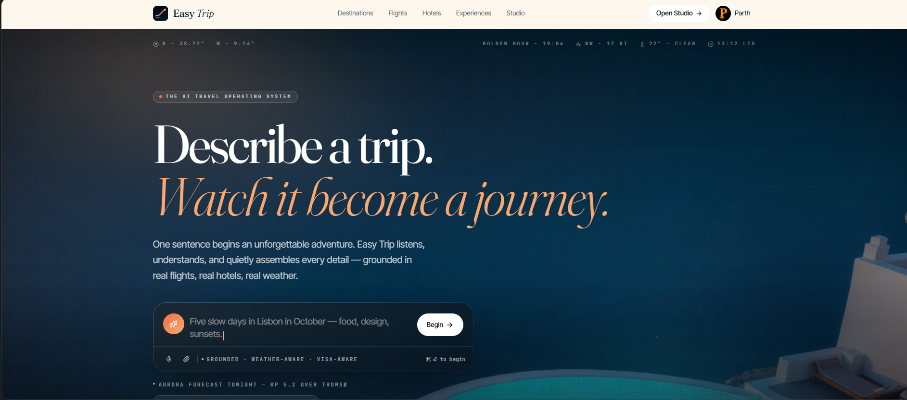
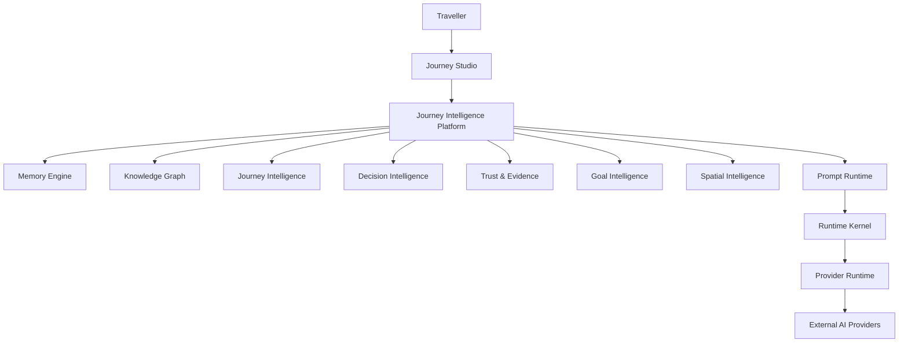

<!-- ========================================================= -->
<!--                        EASY TRIP                           -->
<!-- ========================================================= -->

<h1 align="center">✈️ Easy Trip</h1>

<h3 align="center">
AI-Powered Journey Intelligence Platform for Next-Generation Travel Experiences
</h3>

<p align="center">
From dreaming about a destination to preserving lifelong travel memories,<br>
Easy Trip reimagines how journeys are planned, understood, and experienced through Artificial Intelligence.
</p>

<br>

<p align="center">


</p>

<p align="center">


</p>

---

# 🌍 About Easy Trip

Easy Trip is not just another travel booking platform.

It is an **AI-powered Journey Intelligence Platform** built to transform the entire travel lifecycle—from the moment a traveller imagines a destination to the memories they preserve long after returning home.

Instead of relying on static itineraries or generic recommendations, Easy Trip continuously understands the traveller through contextual memory, intelligent planning, explainable decision making, trust evaluation, spatial reasoning, and adaptive journey orchestration.

The project combines modern software engineering principles with a modular AI architecture to create an experience that feels more like travelling with an intelligent companion than using a traditional travel application.

---

# ✨ Vision

> **Travel should feel personal, effortless, and intelligent—not like filling out endless forms or switching between dozens of disconnected apps.**

Easy Trip aims to become a complete **AI Travel Operating System** where planning, exploration, budgeting, collaboration, booking, and travel memories exist in one continuous workspace.

Instead of optimizing transactions, Easy Trip focuses on designing unforgettable journeys.

---

# 🚀 What Makes Easy Trip Different?

Unlike traditional travel applications, Easy Trip is built around **intelligence**, not just bookings.

<table>
<tr>
<td width="50%">

### 🧠 Persistent Memory

The platform continuously learns from previous trips, preferences, travel companions, budgets, and decisions to provide increasingly personalized experiences.

</td>

<td width="50%">

### 🎯 Goal-Oriented Planning

Trips are planned around long-term goals rather than isolated bookings, allowing the platform to create journeys that evolve with the traveller.

</td>
</tr>

<tr>
<td>

### 🌍 Spatial Intelligence

Geographic understanding enables destination relationships, nearby exploration, regional reasoning, travel corridors, and contextual planning.

</td>

<td>

### 🔍 Explainable Decisions

Every recommendation can be traced back through evidence, confidence scores, and reasoning instead of acting like an opaque black box.

</td>
</tr>

<tr>
<td>

### 🛡 Trust & Evidence

Recommendations are evaluated using deterministic trust models, evidence scoring, freshness analysis, and provenance tracking.

</td>

<td>

### ⚡ Modular AI Platform

Every intelligence capability is implemented as an independent engine communicating only through public contracts and ports.

</td>
</tr>
</table>

---

# 🎬 Preview

<p align="center">

</p>

---

# ⭐ Core Features

## 🧳 Intelligent Travel Planning

- AI-assisted itinerary generation
- Dynamic travel planning
- Goal-oriented journey design
- Multi-stage travel lifecycle
- Personalized recommendations
- Explainable planning decisions

---

## 🧠 AI Journey Intelligence

- Persistent traveller memory
- Knowledge Graph reasoning
- Decision Intelligence
- Goal Intelligence
- Spatial Intelligence
- Trust & Evidence evaluation
- Journey orchestration
- Context-aware recommendations

---

## 🌍 Travel Experience

- Beautiful editorial-inspired interface
- Interactive destination exploration
- Intelligent trip organization
- Real-time contextual insights
- Adaptive planning workflows
- Continuous travel memory

---

## ⚙ Modern Engineering

- Fully modular architecture
- Engine-based AI platform
- Strong TypeScript typing
- Scalable runtime
- Dependency inversion
- Clean Architecture
- SOLID Principles
- Capability-driven design

---

# 💡 Why This Project Exists

Planning a trip today usually means jumping between search engines, spreadsheets, review websites, note-taking apps, messaging platforms, booking portals, maps, and calendars.

The traveller becomes responsible for connecting all these disconnected experiences.

Easy Trip was built to eliminate that fragmentation.

Rather than acting as another booking platform, it becomes the single workspace where travellers can:

- Discover destinations
- Plan complete journeys
- Compare travel decisions
- Organize budgets
- Remember previous trips
- Collaborate with companions
- Build lifelong travel memories

—all powered by an intelligent architecture that improves with every journey.

---

# 🏗 Current Development Status

> **This project is actively under development.**

The platform already includes a production-ready modular intelligence architecture composed of multiple AI engines responsible for memory, planning, trust evaluation, spatial reasoning, goal management, and decision intelligence.

Future milestones will focus on autonomous orchestration, AI agents, Journey Studio, production hardening, and real-world provider integrations.

---

<p align="center">

### ✨ *"Great journeys don't begin with a booking. They begin with understanding the traveller."*

</p>

---

# 🏛️ System Architecture

Easy Trip follows a **modular AI-first architecture** where every intelligence capability is implemented as an independent engine communicating only through well-defined public contracts.

Instead of building one massive AI service, the platform is composed of specialized intelligence engines that cooperate through strict dependency inversion and runtime orchestration.



---

# 🧠 Journey Intelligence Platform

The **Journey Intelligence Platform (JIP)** is the foundation of Easy Trip.

Rather than treating travel planning as a sequence of pages or forms, JIP models the traveller's journey as a continuously evolving intelligence system.

Each engine owns exactly one responsibility while remaining completely independent from the others.

| Engine | Responsibility |
|----------|----------------|
| 🧠 Memory Engine | Persistent traveller memory, history, preferences, context |
| 🗺 Knowledge Graph | Relationship modelling between travellers, places and journeys |
| ✈ Journey Intelligence | Understanding journeys and travel context |
| ⚖ Decision Intelligence | Evaluating and ranking travel alternatives |
| 🛡 Trust & Evidence | Confidence scoring, evidence validation and explainability |
| 🎯 Goal Intelligence | Long-term travel goals, planning and adaptive progress |
| 🌍 Spatial Intelligence | Geographic reasoning, regions, places and travel corridors |
| 💬 Prompt Runtime | Prompt orchestration and provider-independent prompt management |
| ⚙ Runtime Kernel | Shared execution runtime and engine coordination |
| 🔌 Provider Runtime | AI provider abstraction and model routing |

---

# ⚙ Technology Stack

## Frontend

| Technology | Purpose |
|------------|---------|
| React 19 | Component-based UI |
| TypeScript | Type safety |
| TanStack Start | Full-stack React framework |
| Tailwind CSS | Utility-first styling |
| Motion | Rich animations |
| Vite | Development & Build Tool |

---

## Artificial Intelligence

| Technology | Purpose |
|------------|---------|
| Journey Intelligence Platform | AI orchestration |
| Modular Runtime Engines | Independent AI capabilities |
| Knowledge Graph | Relationship reasoning |
| Explainable Decision Engine | Transparent recommendations |
| Trust & Evidence Engine | Confidence scoring |
| Spatial Intelligence Engine | Geographic reasoning |

---

## Engineering

| Technology | Purpose |
|------------|---------|
| GitHub | Version Control |
| GitHub Actions | CI/CD |
| ESLint | Code Quality |
| Prettier | Code Formatting |
| Vitest | Unit Testing |
| Mermaid | Architecture Documentation |

---

# 📂 Project Structure

```text

Easy-Trip/

│

├── public/

│ ├── easytravel.png

│ └── favicon.*

│

├── src/

│

├── app/

├── routes/

├── assets/

├── components/

├── hooks/

├── styles/

│

├── lib/

│ │

│ ├── runtime/

│ ├── provider/

│ ├── prompt/

│ ├── memory/

│ ├── graph/

│ ├── journey/

│ ├── decision/

│ ├── trust/

│ ├── goal/

│ ├── spatial/

│ └── shared/

│

├── tests/

│

├── docs/

│

└── README.md

```

---

# 🔄 Platform Workflow

```text

Traveller

↓

Journey Studio

↓

Goal Understanding

↓

Memory Retrieval

↓

Knowledge Graph

↓

Spatial Intelligence

↓

Journey Intelligence

↓

Decision Intelligence

↓

Trust & Evidence

↓

AI Provider Runtime

↓

Personalized Journey

```

---

# 🏗 Engineering Principles

Easy Trip was engineered around long-term maintainability instead of short-term feature delivery.

The project follows several architectural principles to ensure every subsystem remains modular, scalable, and independently evolvable.

### ✔ Modular Architecture

Every intelligence engine owns a single responsibility.

---

### ✔ Dependency Inversion

All cross-engine communication happens through interfaces and public ports.

---

### ✔ Provider Independence

No business logic depends directly on AI vendors.

Providers can be swapped without affecting platform architecture.

---

### ✔ Explainable AI

Recommendations are generated through deterministic reasoning before provider-based intelligence is introduced.

Every recommendation can be traced back through evidence and confidence.

---

### ✔ Engine Contracts

Every runtime engine publishes:

- Public APIs
- Responsibilities
- Dependencies
- Extension Points
- Capability Manifest

This prevents hidden coupling between subsystems.

---

### ✔ Contract-First Development

Instead of implementing systems directly, every engine begins with architecture specifications and public contracts before implementation starts.

---

### ✔ Clean Architecture

Business logic remains isolated from UI, infrastructure, providers, and frameworks.

---

# 🚧 Engineering Challenges

Developing Easy Trip involved solving several architectural problems beyond a traditional web application.

### 🧠 Designing a Modular AI Platform

Instead of relying on a single AI service, the system was divided into specialized intelligence engines communicating exclusively through public contracts.

---

### 🌍 Geographic Reasoning

Spatial Intelligence was designed independently from mapping providers to avoid vendor lock-in while enabling deterministic geographic reasoning.

---

### ⚖ Explainable Decision Making

Recommendations are evaluated through deterministic scoring, trust validation, evidence analysis, and constraint reasoning before presentation.

---

### 🔒 Long-Term Maintainability

Strict dependency boundaries ensure every intelligence engine can evolve independently without breaking the rest of the platform.

---

### 📈 Scalability

The architecture was intentionally designed for future capabilities such as:

- Autonomous AI Agents
- Multi-provider orchestration
- Real-time travel adaptation
- Continuous traveller learning
- Enterprise deployment

---

# 📊 Development Progress

| Sprint | Status |
|----------|--------|
| Memory Engine | ✅ Complete |
| Prompt Runtime | ✅ Complete |
| Runtime Kernel | ✅ Complete |
| Provider Runtime | ✅ Complete |
| Knowledge Graph | ✅ Complete |
| Journey Intelligence | ✅ Complete |
| Decision Intelligence | ✅ Complete |
| Trust & Evidence | ✅ Complete |
| Goal Intelligence | ✅ Complete |
| Spatial Intelligence | ✅ Complete |
| Capability & Tool Runtime | 🚧 In Progress |
| AI Agent Runtime | ⏳ Planned |
| Journey Studio | ⏳ Planned |
| Production Hardening | ⏳ Planned |

---

# 💎 What Makes Easy Trip Unique?

Most travel applications focus on **booking trips**.

Easy Trip focuses on **understanding travellers**.

Instead of simply answering:

> "Where do you want to go?"

Easy Trip continuously learns:

- Why you travel
- How you travel
- Who you travel with
- What experiences matter most
- How your preferences evolve over time

The result is a travel platform that becomes more intelligent with every journey instead of resetting after every booking.

---
---

# 🚀 Getting Started

Follow these steps to run Easy Trip locally.

## Prerequisites

Ensure you have the following installed:

- Node.js 20+
- Bun (Recommended) or npm
- Git

---

## Clone the Repository

```bash
git clone https://github.com/gulshanverse/easy-trip.git

cd easy-trip
```

---

## Install Dependencies

Using Bun (Recommended)

```bash
bun install
```

Using npm

```bash
npm install
```

---

## Start Development Server

```bash
bun run dev
```

or

```bash
npm run dev
```

The application will be available at:

```
http://localhost:3000
```

---

# 📦 Production Build

```bash
bun run build
```

Preview the production build

```bash
bun run preview
```

---

# 🧪 Running Tests

Run all tests

```bash
bun test
```

Run specific tests

```bash
bun vitest
```

Run TypeScript checks

```bash
bunx tsc --noEmit
```

Run linting

```bash
bun run lint
```

---

# 🔐 Environment Variables

Create a `.env.local` file in the project root.

```env
# AI Provider Keys (Future Integration)

OPENAI_API_KEY=

GOOGLE_API_KEY=

ANTHROPIC_API_KEY=

GROQ_API_KEY=

OPENROUTER_API_KEY=

# Database (Future)

DATABASE_URL=

# Authentication (Future)

AUTH_SECRET=
```

> **Note:** Most AI integrations are intentionally abstracted behind the Provider Runtime and will be connected in future implementation phases.

---

# 🏗 Engineering Philosophy

Easy Trip is engineered with long-term maintainability in mind.

The project follows several architectural principles:

- Domain-Driven Design (DDD)
- Clean Architecture
- SOLID Principles
- Contract-First Development
- Dependency Inversion
- Engine-Based Modularity
- Explainable AI
- Provider Independence
- Strong Type Safety
- Test-Driven Engineering

Every subsystem communicates through explicit contracts rather than direct implementation dependencies, making the platform easier to scale, test, and evolve.

---

# 📈 Quality & Engineering Standards

The project emphasizes engineering quality alongside feature development.

### Code Quality

- ✅ TypeScript Strict Mode
- ✅ ESLint
- ✅ Modular Architecture
- ✅ Immutable Domain Models
- ✅ Public Engine Contracts
- ✅ Capability Manifests
- ✅ Interface-Driven Development

---

### Testing

- ✅ Unit Tests
- ✅ Integration Tests
- ✅ Cross-Engine Interoperability Tests
- ✅ Architecture Fitness Tests
- ✅ Stress Tests
- ✅ Performance Benchmarks

---

### AI Engineering

- ✅ Journey Intelligence
- ✅ Decision Intelligence
- ✅ Trust & Evidence
- ✅ Goal Intelligence
- ✅ Spatial Intelligence
- ✅ Explainable Decision Pipeline
- ✅ Provider Abstraction Layer
- ✅ Knowledge Graph Reasoning

---

# 🛣 Project Roadmap

## Phase 1 — Intelligence Foundation ✅

- Memory Engine
- Prompt Runtime
- Runtime Kernel
- Provider Runtime
- Knowledge Graph
- Journey Intelligence
- Decision Intelligence
- Trust & Evidence
- Goal Intelligence
- Spatial Intelligence

---

## Phase 2 — Intelligence Orchestration 🚧

- Capability & Tool Orchestration Runtime
- Autonomous AI Agent Runtime
- Multi-Agent Collaboration
- Workflow Execution Engine

---

## Phase 3 — Product Experience

- Journey Studio
- Real-Time Collaboration
- AI Travel Assistant
- Personalized Travel Dashboard
- Cross-Device Synchronization

---

## Phase 4 — Production

- Cloud Deployment
- Enterprise Authentication
- External Travel APIs
- Payment Integration
- Booking Integrations
- Analytics
- Monitoring
- Observability

---

# 🤝 Contributing

Contributions, suggestions, and discussions are always welcome.

If you'd like to contribute:

1. Fork the repository

2. Create a new branch

```bash
git checkout -b feature/amazing-feature
```

3. Commit your changes

```bash
git commit -m "feat: add amazing feature"
```

4. Push the branch

```bash
git push origin feature/amazing-feature
```

5. Open a Pull Request

Please ensure all tests pass before submitting changes.

---

# 📄 License

This project is licensed under the MIT License.

See the **LICENSE** file for more information.

---

# 👨‍💻 Author

<div align="center">

## Gulshan Kumar

**Software Engineer • AI Engineer • Full Stack Developer**

Building intelligent software systems that combine scalable engineering with thoughtful user experiences.

</div>

---

# 🌟 Support the Project

If you found this project interesting or helpful:

⭐ Star the repository

🍴 Fork the repository

💬 Share feedback

🐞 Report issues

❤️ Contribute improvements

Every contribution helps make Easy Trip better.

---

<div align="center">

## ✈️ Easy Trip

### *"Travel isn't just about reaching destinations. It's about understanding every journey."*

---

Made with ❤️ using **React**, **TypeScript**, and a custom-built **Journey Intelligence Platform**.

</div>

