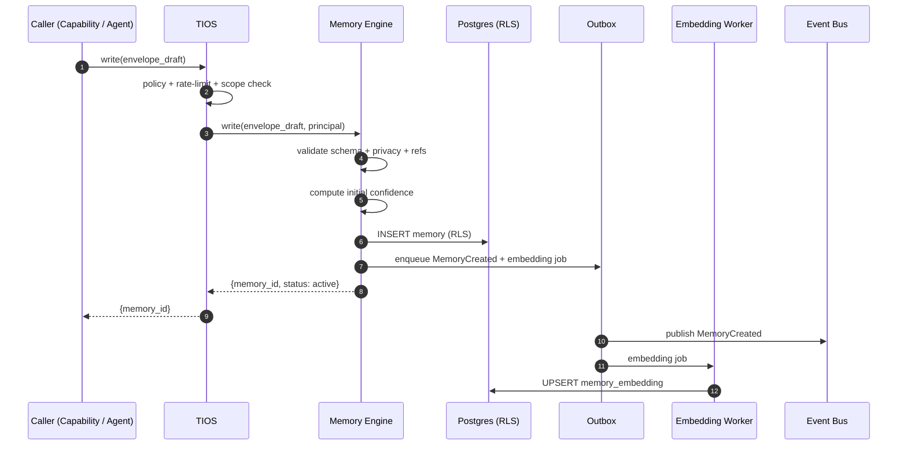
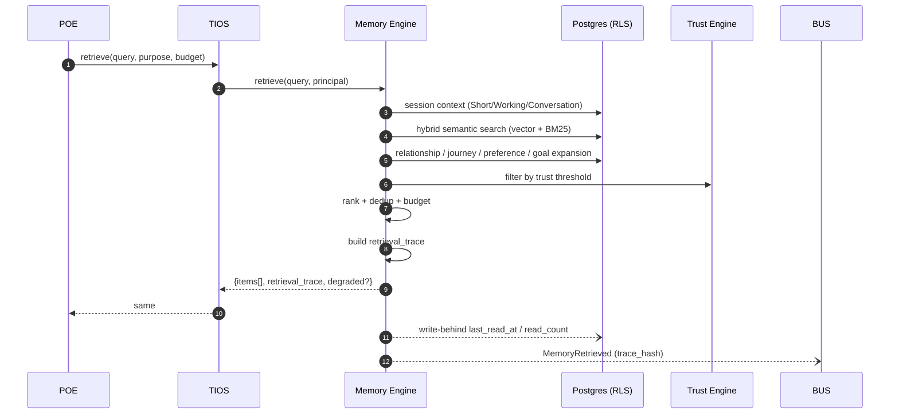
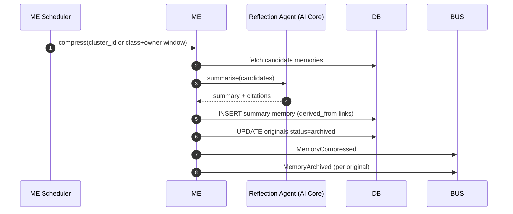
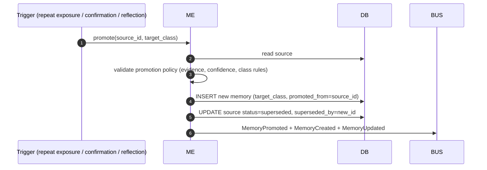
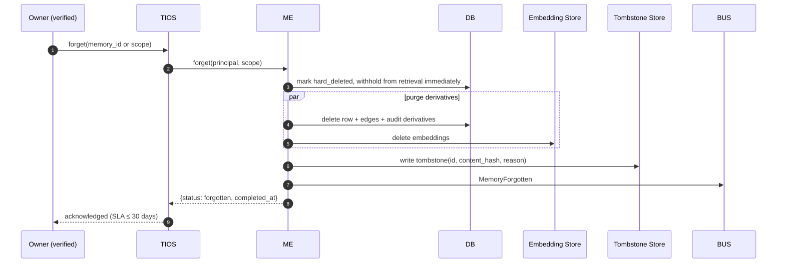
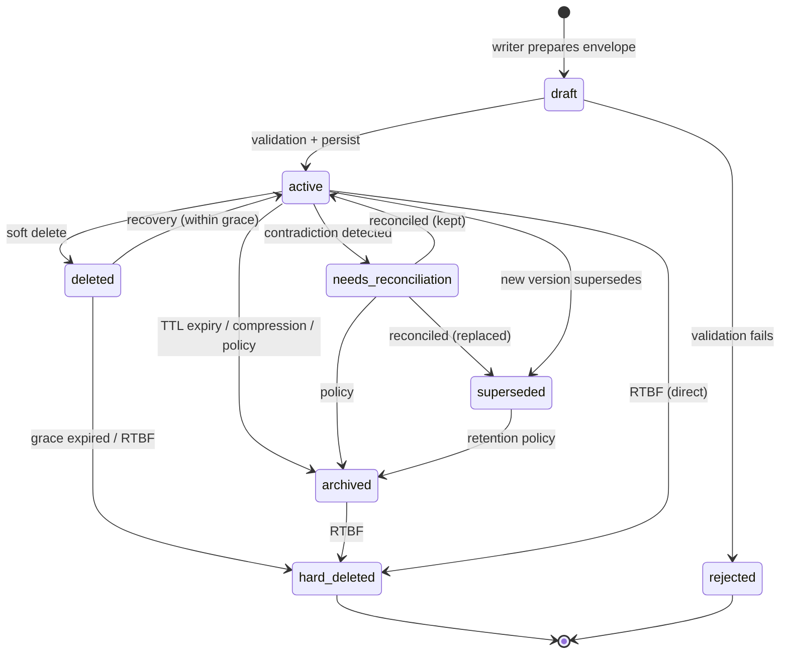

# EDS-001 v2.0 — Memory Engine Production Engineering Specification

- **Status:** Frozen
- **Version:** 2.0
- **Frozen:** 2026-07-09
- **Supersedes:** `docs/EDS-001_MEMORY_ENGINE.md` v1.1 (retained; this document is the authoritative successor)
- **Owner:** Intelligence Engineering
- **Governed By:** `docs/engineering/EBP-001_ENGINEERING_BLUEPRINT.md`
- **Parent Architecture:** `docs/JOURNEY_INTELLIGENCE_PLATFORM_v1.3.md` (Frozen)
- **Depends On:** Master Vision v1.0, PRD v2.0, JIP v1.3, EBP-001 v1.0
- **Consumers:** EDS-002 (POE), future EDS-003/004/005/006/007/008, all implementation waves
- **Amendment Policy:** Frozen. Changes require an ADR and a versioned successor (`EDS-001 v2.x`).

> EDS-001 v2.0 is the definitive engineering specification for the Easy Trip Memory Engine (ME). It converts the frozen architectural intent (JIP v1.3) and the earlier engineering pass (v1.1) into a production-ready blueprint. Engineers implementing the Memory Engine SHOULD find every architectural question answered here; anything unspecified is a defect in this document, not a decision for implementers.

Normative language follows RFC 2119 (MUST / SHOULD / MAY).

---

## 0. Non-Modification Guarantee

This document is documentation only. It does NOT modify UI, homepage, Journey Studio, AI Core, TIOS, TIE, backend, APIs, routing, authentication, database schema, JIP, or EBP. All frozen baselines remain untouched. No production code is introduced.

---

## 1. Purpose

### 1.1 Why the Memory Engine Exists
Easy Trip must feel *proactive and alive* (Master Vision, Core memory). That behaviour is impossible without a substrate that:
- Remembers what a traveller told the platform (explicitly and implicitly).
- Recalls the right subset of that memory at the right moment, with justification.
- Forgets what should not persist — for privacy, for freshness, for correctness.
- Grounds every AI decision in verifiable prior state.

The Memory Engine (ME) is the *persistence and recall substrate* of the Journey Intelligence Platform (JIP). It is the only sanctioned way any subsystem persists or retrieves traveller-scoped knowledge.

### 1.2 Responsibilities (Owns)
1. Persist typed memory objects across all classes defined in §2, with confidence, provenance, and TTL.
2. Retrieve memories under a bounded budget with deterministic ranking and explainability.
3. Enforce isolation (per-user, per-tenant, per-relationship scope) at both build time (types) and runtime (RLS).
4. Manage lifecycle: creation, validation, decay, promotion, compression, archiving, deletion, recovery.
5. Emit domain events describing every state transition (§13).
6. Publish evaluation signals (retrieval precision, recall, degradation reasons) to observability.
7. Honour privacy and right-to-be-forgotten within contractual SLAs (§8).

### 1.3 Non-Responsibilities (Does NOT Own)
- LLM inference (belongs to AI Core / POE — EDS-002).
- Prompt construction (POE consumes ME output; ME does not format prompts).
- Business logic: journey planning, booking, pricing, itinerary optimisation (TIE + capabilities).
- UI state and presentation (Journey Studio + design system).
- Multi-agent arbitration or routing (UDE / MAG — future EDS-003).
- World-state modelling: weather, availability, prices (TIE / WIM).
- Authentication and role management (Supabase + `user_roles`).

If a request looks like ME's responsibility but falls into a Non-Responsibility, ME MUST refuse or route via TIOS to the correct owner.

---

## 2. Memory Philosophy

The Memory Engine is stratified by **lifetime, scope, and permanence** — not by feature. Every class listed below shares the same envelope (§4) and differs only in defaults for TTL, decay, promotion, and visibility.

| # | Class | Horizon | Scope | Purpose | Default TTL | Promotable? |
|---|---|---|---|---|---|---|
| 1 | **Short-term** | seconds → minutes | session | Ephemeral working buffer for the current turn | 5 min | → Working |
| 2 | **Working** | minutes → hours | session / task | Active reasoning scratchpad; last N turns | 4 h | → Conversation |
| 3 | **Conversation** | hours → days | thread | Ordered dialogue history with roles and citations | 30 d | → Episodic / Preference |
| 4 | **Journey** | days → years | journey | Facts, decisions, drafts and versions bound to a Journey | until journey deleted | → Episodic / Portfolio |
| 5 | **Preference** | months → years | user | Stable likes/dislikes, thresholds, styles | 24 mo (refreshed on use) | → Semantic |
| 6 | **Semantic** | long-lived | user / tenant | Facts about the world/user without episodic context | indefinite | — |
| 7 | **Episodic** | long-lived | user | "What happened" narratives with time, place, actors | 5 y | → Archive |
| 8 | **Relationship** | long-lived | user + companions | Ties between travellers, groups, roles, permissions | until relationship ends | — |
| 9 | **Spatial** | long-lived | user / global | Place-anchored knowledge (visited, wishlisted, avoided) | indefinite | → Semantic |
| 10 | **Goal** | months → years | user / journey | Long-horizon traveller goals and milestones | until goal closed | → Episodic on close |
| 11 | **Trust** | rolling | user / source | Confidence in a source, agent, or memory itself | rolling window | — |
| 12 | **Reflection** | days → months | user / agent | Post-hoc summaries, lessons, self-critiques | 12 mo | → Semantic |
| 13 | **Portfolio** | long-lived | user | Cross-journey aggregates and optimisation state | indefinite | — |
| 14 | **Archive** | cold | user | Compressed / superseded memories retained for audit and RTBF | policy-driven | — |
| 15 | **Knowledge Graph** | long-lived | tenant / global | Nodes and edges over entities, places, concepts | indefinite | — |

### 2.1 Distinguishing Rules
- **Short-term vs Working:** Short-term dies with the turn; Working survives the task.
- **Conversation vs Episodic:** Conversation preserves turn-by-turn structure; Episodic collapses it into a narrative on promotion.
- **Preference vs Semantic:** Preferences are *about the user*; Semantic is *about the world* (may include user-agnostic facts learned from the user).
- **Journey vs Portfolio:** Journey memories belong to a single trip; Portfolio spans the traveller's whole set of trips.
- **Goal vs Reflection:** Goals are forward-looking commitments; Reflections are backward-looking assessments.
- **Trust vs Confidence:** Trust is per-source (belief in the well); Confidence is per-memory (belief in the water).
- **Archive is not deletion:** Archived memories are unreachable by ordinary retrieval but preserved for audit/RTBF/legal.

### 2.2 Class Selection
The class of a new memory is assigned by the writer at creation and MAY be re-classified by a promotion (§3.8). Class MUST NOT be silently changed by retrieval.

---

## 3. Memory Lifecycle

The full lifecycle applies to every class; defaults differ. Every transition emits a domain event (§13).

### 3.1 Creation
- Origin: `user_explicit`, `user_implicit`, `agent_inference`, `system_derived`, `import`.
- Writer supplies: class, kind, payload, source, evidence pointers, initial confidence, scope, tags.
- Server assigns: `memory_id`, `created_at`, `owner_id`, `tenant_id`, initial `version=1`, initial `decay_state`.

### 3.2 Validation
- Schema validation against class-specific payload schema (Zod at boundary).
- Referential validation: `evidence[*]` and `related_ids[*]` MUST resolve or be null.
- Privacy validation: `visibility` MUST be compatible with owner and scope (§8).
- Contradiction detection: run cheap similarity check against existing memories of the same kind and same owner; if hard contradiction detected, mark `status='needs_reconciliation'`.

### 3.3 Confidence Assignment
Initial confidence is computed via the framework in §6. It is stored on the memory and re-evaluated on read.

### 3.4 Storage
- Written to primary store (Postgres) under RLS.
- Embeddings computed asynchronously via transactional outbox; embedding failures do not block writes.
- Object payloads > threshold offloaded to object storage; row keeps a signed reference.

### 3.5 Retrieval
Covered in §5. Retrieval never mutates memory content; it MAY update `last_read_at`, `read_count`, and `decay_state` via a write-behind path.

### 3.6 Ranking
Retrieval returns candidates; ranking (§5.8) combines confidence, similarity, recency, importance, trust, and diversity into a final ordered list, always with per-item score decomposition.

### 3.7 Decay
- Every class declares a decay curve (exponential, step, or none) parameterised by half-life.
- Decay lowers effective confidence at read time; stored confidence is unchanged unless a promotion or reflection triggers a rewrite.
- Access refreshes decay for that memory (usage-based reinforcement) up to a per-class cap.

### 3.8 Promotion
- A memory may be promoted from a shorter-lived class to a longer-lived one when triggers fire (repeat exposure, explicit confirmation, evidence accumulation, reflection).
- Promotion is an event-sourced write: a new memory of the target class is created, with a `promoted_from = source_memory_id` link. The source is not mutated; it MAY be archived.

### 3.9 Compression
- Compression converts N related memories into 1 summary memory with links back to the originals.
- Compressed originals are archived, not deleted, unless RTBF applies.
- Compression is triggered by budget pressure (§9), scheduled reflection, or explicit user action.

### 3.10 Archiving
- Archived memories remain in cold storage with reduced indexing.
- Excluded from ordinary retrieval; included only when the caller explicitly requests archived scope with appropriate authorization.

### 3.11 Deletion
- Two deletion modes:
  - **Soft delete:** `status='deleted'`, retained for a grace window (default 30 d), invisible to ordinary retrieval, recoverable.
  - **Hard delete (RTBF):** row and derivatives (embeddings, summaries, indices) purged; a tombstone hash retained to satisfy audit without preserving content.

### 3.12 Recovery
- Soft-deleted memories are recoverable within the grace window by an authorised actor. Recovery restores previous `status` and emits `MemoryUpdated`.
- Hard-deleted memories are unrecoverable by definition.

### 3.13 Terminal States
`archived`, `superseded`, `hard_deleted`. No transition out of `hard_deleted`.

---

## 4. Memory Objects

All memories share a **common envelope**. Class-specific fields live inside `payload` under a class-scoped schema.

### 4.1 Common Envelope

| Field | Type | Description |
|---|---|---|
| `memory_id` | UUID | Immutable identifier. |
| `class` | Enum (§2) | Memory class. |
| `kind` | string (kebab-case) | Sub-type within class (`preference/cuisine`, `journey/note`). |
| `owner_id` | UUID | Traveller who owns the memory. |
| `tenant_id` | UUID \| null | For future multi-tenant deployments. |
| `scope` | Enum | `session` \| `thread` \| `journey` \| `user` \| `group` \| `tenant` \| `global`. |
| `visibility` | Enum (§8) | `private` \| `shared` \| `team` \| `public`. |
| `payload` | JSON | Class-specific schema-versioned body. |
| `payload_schema_version` | int | Schema version of `payload`. |
| `source` | Object | `{kind, actor_id, provenance}` — see §4.3. |
| `evidence` | Array\<EvidenceRef\> | Pointers to grounding facts (§4.4). |
| `confidence` | float [0,1] | Stored confidence (§6). |
| `importance` | float [0,1] | Domain-assigned salience. |
| `trust_source_id` | UUID \| null | Trust anchor for the source (§6). |
| `tags` | string[] | Free-form kebab-case tags. |
| `relationships` | Array\<Edge\> | Typed edges to other memories (§7). |
| `related_ids` | UUID[] | Denormalised fast lookup for common edges. |
| `ttl_expires_at` | timestamp \| null | Hard expiry; nullable for indefinite. |
| `decay_state` | Object | `{half_life_s, last_reinforced_at, read_count}`. |
| `status` | Enum | `active` \| `needs_reconciliation` \| `superseded` \| `archived` \| `deleted` \| `hard_deleted`. |
| `version` | int | Envelope version (bumped on non-content updates). |
| `content_hash` | bytes | SHA-256 of canonicalised payload; identity for dedup. |
| `created_at` | timestamp | Server assigned. |
| `updated_at` | timestamp | Server assigned. |
| `last_read_at` | timestamp \| null | Updated write-behind. |
| `read_count` | int | Monotonic. |
| `promoted_from` | UUID \| null | Provenance chain for promotion. |
| `superseded_by` | UUID \| null | Points to newer version. |
| `redaction` | Object \| null | Field-level redaction descriptors (§8). |

### 4.2 Versioning
- **Payload schema:** `payload_schema_version` uses monotonic ints per class; migrations follow Expand → Migrate → Contract (per EBP §14). Old readers MUST tolerate unknown optional fields.
- **Memory content:** content changes create a **new memory** with `superseded_by` on the old and `promoted_from`/`derived_from` on the new. Envelope fields (tags, importance, decay_state) MAY be updated in place with `version++`.

### 4.3 `source` Object
| Field | Description |
|---|---|
| `kind` | `user_explicit` \| `user_implicit` \| `agent_inference` \| `system_derived` \| `import`. |
| `actor_id` | UUID of the actor (user id, agent id, system id). |
| `provenance` | Structured trace (POE run id, tool call id, upstream memory ids). |

### 4.4 `EvidenceRef`
| Field | Description |
|---|---|
| `evidence_id` | UUID from Trust & Evidence Engine (future EDS-008). |
| `kind` | `citation` \| `observation` \| `computation` \| `user_statement`. |
| `weight` | float [0,1] — contribution to confidence. |
| `uri` | Optional pointer to external source. |

### 4.5 `Edge` (Relationship)
| Field | Description |
|---|---|
| `type` | `derived_from`, `contradicts`, `supports`, `refines`, `about_entity`, `about_place`, `about_time`, `member_of_cluster`, `promoted_from`, `compressed_into`. |
| `target_id` | UUID of the other memory or Knowledge Graph node. |
| `weight` | float [0,1] — edge strength. |
| `meta` | Optional structured detail. |

### 4.6 Privacy Metadata
Every memory carries `visibility` and optional `redaction`. See §8.

### 4.7 Ownership Rules
- `owner_id` is immutable.
- `tenant_id` is immutable for the lifetime of the memory.
- Transfer of ownership is disallowed; if required, create a new memory with `derived_from` link.

### 4.8 TTL Rules
- `ttl_expires_at = null` means indefinite (subject to class defaults).
- On expiry, ME moves the memory to `archived` (default) or `hard_deleted` (if class policy or user policy requires).

---

## 5. Retrieval Pipeline

Retrieval is a deterministic, staged pipeline. Every stage produces auditable output that the Explainability Engine (future EDS-008) can render.

```text
Query ─▶ (1) Context Retrieval ─▶ (2) Semantic Search ─▶ (3) Relationship Expansion
     ─▶ (4) Journey Expansion ─▶ (5) Preference Expansion ─▶ (6) Goal Expansion
     ─▶ (7) Trust Filtering ─▶ (8) Ranking ─▶ (9) Deduplication ─▶ (10) Final Assembly
```

### 5.1 Context Retrieval
- Input: `{owner_id, thread_id?, journey_id?, goal_ids?, purpose, budget}`.
- Pulls Short-term + Working + active Conversation for the current session; these are always included (subject to budget) before any semantic search.

### 5.2 Semantic Search
- Hybrid retrieval over Semantic, Episodic, Preference, Journey, Spatial, Reflection classes:
  - Vector similarity (pgvector) with class-specific embedding namespaces.
  - Lexical BM25 over normalised payload text.
  - Recency prior derived from `updated_at` and `last_read_at`.
- Fusion via reciprocal-rank fusion (RRF) with class-weighted priors.

### 5.3 Relationship Expansion
- For each top-K candidate, expand along `related_ids` and `relationships[]` edges up to depth D (default 1) with edge-weight decay.
- Expansion candidates re-enter the ranking stage; they never bypass it.

### 5.4 Journey Expansion
- If `journey_id` is present, pull Journey-class memories directly; join Portfolio-class where the journey participates in a portfolio decision.

### 5.5 Preference Expansion
- Pull the user's Preference-class memories whose `kind` intersects the query's inferred topics (topic taxonomy is a Knowledge Graph concern).

### 5.6 Goal Expansion
- Pull active Goal-class memories for the owner; open goals bias downstream ranking toward goal-relevant items.

### 5.7 Trust Filtering
- Drop candidates whose `source.trust_source_id` currently sits below the query-declared minimum trust.
- Demote (not drop) candidates with `status='needs_reconciliation'` unless the caller opts in.

### 5.8 Ranking
- Score = `w_conf · confidence_effective + w_sim · similarity + w_rec · recency + w_imp · importance + w_trust · trust + w_goal · goal_alignment − w_contra · contradiction_penalty`.
- Weights are per-purpose profiles (`companion_turn`, `composer_suggest`, `recommendation`, `explanation`); profiles are versioned.
- Ranking output includes the full score decomposition per item.

### 5.9 Deduplication
- Group by `content_hash`; keep the highest-ranked representative.
- Near-duplicate detection via MinHash over payload tokens; near-dupes collapse into one representative with `also_seen_ids[]`.

### 5.10 Final Assembly
- Apply budget (§9): token budget, item cap, per-class caps, diversity floor.
- Emit the ordered list plus a `retrieval_trace` object (query, weights, per-stage counts, dropped-because-of reasons).
- Emit `MemoryRetrieved` event with the trace hash (not the content).

### 5.11 Determinism
Given identical inputs (query, owner state, weights profile, ranking model version, timestamp bucket), retrieval MUST return identical ordered ids. Non-determinism is a defect.

---

## 6. Confidence Framework

Confidence is a single scalar in [0,1] computed from many signals. It is used in ranking (§5.8), in gating (Trust Engine may reject low-confidence facts), and in UI ("we're not sure about this").

### 6.1 Signals
| Signal | Description | Direction |
|---|---|---|
| **Freshness** | Time since last update / reinforcement. | Newer → higher. |
| **Frequency** | How often the memory has been observed / confirmed. | More → higher. |
| **Explicitness** | User_explicit > user_implicit > agent_inference > system_derived. | More explicit → higher. |
| **Evidence** | Number and weight of `EvidenceRef` items. | More weight → higher. |
| **Consistency** | Agreement with other memories in the same neighbourhood. | Consistent → higher. |
| **Contradictions** | Presence of `contradicts` edges. | More → lower. |
| **Manual Confirmation** | User confirmed via UI. | Confirmed → higher, sticky. |
| **AI Confidence** | Producer agent's self-reported confidence. | Signal only; capped in fusion. |
| **Human Confidence** | Reviewer / owner rating. | Overrides AI when present. |
| **Trust of Source** | Trust score of originating source. | Higher → higher. |

### 6.2 Fusion
Confidence is computed as a bounded weighted mean:

`confidence_stored = clip( Σ w_i · signal_i , 0, 1 )`

Weights per class are versioned; a change of weights bumps a `confidence_model_version` recorded on the memory for reproducibility.

### 6.3 Effective Confidence at Read Time
`confidence_effective = confidence_stored · decay(class, now − last_reinforced_at) · trust_factor(source)`

Decay is class-specific. `trust_factor` reflects the current trust of the source (which may have moved since write).

### 6.4 Confidence Decay
- Decay curve: default exponential with class-specific half-life; some classes (Preference, Semantic) use step decay (no decay for T, then decay).
- Manual Confirmation halts decay for a configurable window.
- Reading a memory partially reinforces it (bounded to prevent unbounded self-reinforcement).

### 6.5 Contradictions
When a contradicting memory is written, both are marked `needs_reconciliation` and Reflection is scheduled. Reconciliation MAY produce a new consolidated memory that supersedes both.

---

## 7. Memory Graph

### 7.1 Nodes
Nodes are memories (envelope in §4) and Knowledge Graph entities (owned by future EDS-004). ME does not own KG entities; it references them by URN.

### 7.2 Edges
Edge types are enumerated in §4.5. Every edge is typed, weighted, and directional.

### 7.3 Clusters
- A cluster is a dense sub-graph of memories about the same subject (a Journey, a Place, a Goal, a Companion).
- Clusters have an owner memory (`kind='cluster'`) and `member_of_cluster` edges from members.

### 7.4 Cross-links
Cross-links join memories across clusters (e.g., a Reflection about Journey A that shifts a Preference used in Journey B). Cross-links are first-class edges, not implicit.

### 7.5 Graph Traversal
- Bounded BFS with edge-type filters and edge-weight thresholds.
- Cycle-safe by design (visited set is required).
- Maximum depth per retrieval purpose is a config value; default 1 for interactive turns, up to 3 for reflective batch jobs.

### 7.6 Knowledge Propagation
- Confidence, importance, and status changes MAY propagate along edges under explicit rules (e.g., archiving a Journey archives its Journey-class children).
- Propagation is event-driven, not reactive at read time.

### 7.7 Relationship Discovery
- Offline job proposes new edges from statistical co-occurrence, semantic similarity, and temporal correlation.
- Proposals require confidence ≥ threshold to be persisted; below threshold, they are logged for evaluation.
- No auto-created edge is ever destructive (edges may only add or refine, never remove existing content).

---

## 8. Privacy Rules

### 8.1 Visibility Levels
| Level | Who Can Read |
|---|---|
| `private` | `owner_id` only. Default. |
| `shared` | `owner_id` + explicit ACL of user ids. |
| `team` | Members of the owner's declared group / companion set. |
| `public` | Any authenticated user in the same tenant. Never PII by policy. |

Visibility is a hard filter enforced at the storage boundary (RLS) and re-checked at the retrieval boundary (defence-in-depth).

### 8.2 Redaction
- Field-level redaction descriptors mark PII fields (`email`, `phone`, `address`, free-text with detected PII).
- Redacted fields are stored encrypted at rest and returned masked to non-owner readers.
- Logs and traces MUST NOT contain non-redacted values (per EBP §8).

### 8.3 Deletion (Soft)
- Default deletion is soft (§3.11) with a 30-day grace window; recoverable by the owner or an authorised admin.

### 8.4 GDPR-style Forget (RTBF)
- Hard delete purges the row, its embeddings, its cluster references, and any derivatives (summaries, reflections that quote the content).
- A tombstone (`memory_id`, `content_hash`, `deleted_at`, `reason`) is retained to satisfy audit without preserving content.
- SLA: RTBF completes within 30 days of a verified request. Interim, the memory is immediately withheld from all retrieval and marked `hard_deleted` pending purge.

### 8.5 Export
- The owner MAY request a machine-readable export of all memories they own; export includes envelope + payload for `private`/`shared` scopes only.

### 8.6 Cross-Tenant Isolation
Cross-tenant reads are impossible by construction: `tenant_id` is part of every RLS predicate.

---

## 9. Retrieval Budget

### 9.1 Maximum Context
Each purpose profile declares:
- `max_items` — hard cap on returned memories.
- `max_tokens` — hard cap on serialised payload tokens (via POE's tokenizer).
- `per_class_caps` — per-class item caps to preserve diversity.
- `min_confidence` — floor below which items are dropped.
- `diversity_floor` — required minimum distinct clusters or classes.

### 9.2 Token Budgeting
- ME reports estimated tokens per candidate using the POE tokenizer contract.
- The retrieval pipeline is budget-aware: candidates are added greedily by rank until token budget is exhausted, with a *reserved slice* per class to prevent one class from starving the rest.

### 9.3 Ranking Strategy
See §5.8. Weights are per-purpose and versioned.

### 9.4 Priority Rules
1. Session-scoped context (Short-term, Working) is always included first.
2. Explicit `pinned` memories (owner-marked) are always included.
3. Journey / Goal / Preference expansions get reserved slices.
4. Semantic search fills the remaining budget.
5. Diversity floor is enforced *after* rank; if unmet, lowest-ranked duplicates are dropped in favour of higher-diversity candidates.

### 9.5 Compression
When retrieval demand exceeds budget, ME MAY:
- Serve compressed summaries in place of originals for over-budget classes.
- Trigger asynchronous compression jobs to lower future budget pressure.

### 9.6 Summarization
- Summarisation is performed by an ME-owned Reflection agent (invoked via AI Core), not ad-hoc.
- Summaries carry `derived_from` links to sources and inherit the strictest visibility across sources.

---

## 10. Failure Modes

| Failure | Detection | Response |
|---|---|---|
| **Missing memory** (expected id not found) | Retrieval returns fewer than expected; ID lookups fail. | Return partial with `degraded=true` and reason `missing`; log; do not synthesise. |
| **Corrupted memory** (schema mismatch, hash mismatch) | Validation on read fails. | Move to `needs_reconciliation`; exclude from ranking; alert. |
| **Contradictions** | Consistency check on write / periodic sweep. | Both marked `needs_reconciliation`; Reflection scheduled; ranking demotes both. |
| **Duplicates** | `content_hash` collision. | Merge on write; on read, dedup (§5.9). |
| **Expired memories** | `ttl_expires_at < now`. | Excluded from ordinary retrieval; class policy decides archive vs hard-delete. |
| **Hallucinated memories** (agent-written without evidence) | Missing `evidence[]`, low confidence, contradicts existing. | Store with `status='needs_reconciliation'`; require evidence before promotion; never auto-promoted. |
| **Embedding failures** | Outbox retries exhausted. | Memory remains retrievable via lexical + relationship paths; alert; retry with backoff. |
| **Retrieval timeout** | Per-stage timeouts. | Return partial result with `degraded=true`; downstream (POE) decides continue or fail. |
| **Ranking model regression** | Golden-set eval failure. | Auto-rollback to previous ranking model version; alert. |
| **RLS breach attempt** | Query attempts cross-owner read. | Refuse, log at `warning`, emit security event; never partial-return other-owner data. |

### 10.1 Fallback Strategy
Retrieval degrades in this order: full → drop expansions → drop semantic (session-only) → empty (with `degraded=true`). ME never fabricates memories; POE handles the empty case.

---

## 11. APIs (Reserved)

No API contracts are frozen in this document. Interface intent (types and semantics) is captured here so downstream EDSs can consume it without ambiguity. Concrete signatures are the subject of the implementation PR governed by EBP §17.

### 11.1 Intended Interfaces (Behavioural, Not Syntactic)
- **write** — accept an envelope draft, validate, persist, emit `MemoryCreated`. Idempotent by `(owner_id, content_hash, class, kind)`.
- **update** — non-content envelope updates (tags, importance, status transitions). Emits `MemoryUpdated`.
- **supersede** — write a new memory that replaces one or more prior memories via `superseded_by`. Emits `MemoryUpdated` on originals and `MemoryCreated` on successor.
- **retrieve** — accept `{owner_id, purpose, query, filters, budget}`, return ordered candidates + `retrieval_trace`. Emits `MemoryRetrieved`.
- **get** — direct id lookup, RLS-scoped.
- **archive / restore** — lifecycle transitions.
- **delete (soft)** / **forget (hard)** — deletion tiers per §8.
- **promote / compress / reflect** — internal lifecycle operations, callable only by ME's own scheduler or an authorised agent.

### 11.2 Contract Rules
- All calls are RLS-scoped by `owner_id` derived from the authenticated principal — never from client input.
- Every response carries a `correlation_id` matching the request.
- Errors follow the EBP §7 taxonomy.

### 11.3 Versioning
Interfaces evolve via Expand → Migrate → Contract. Breaking changes require an ADR.

---

## 12. Database (Reserved — Logical Schema Only)

No SQL. No migrations. No physical schema. The below is the logical model implementers MUST realise, in whichever physical shape best serves the platform's chosen primitives (Postgres + pgvector today).

### 12.1 Logical Entities

- **Memory** — the envelope (§4). One row per memory.
- **MemoryEdge** — one row per typed edge (§4.5) with `(source_id, target_id, type, weight, meta)`.
- **MemoryEmbedding** — one row per `(memory_id, embedding_namespace)`; multiple namespaces per memory permitted.
- **MemoryPayloadBlob** — off-row payload storage reference for large payloads.
- **MemoryEventOutbox** — transactional outbox for domain events (§13); consumed by an event dispatcher.
- **MemoryAuditLog** — append-only record of privileged operations (RTBF, admin overrides).
- **MemoryTombstone** — post-RTBF record (id, hash, timestamp, reason).
- **MemoryTrustAnchor** — trust source registry referenced by `source.trust_source_id`.
- **MemoryPurposeProfile** — versioned ranking weight profile.
- **MemoryConfidenceModel** — versioned confidence weights and decay parameters per class.

### 12.2 Isolation
Every row-level entity carries `owner_id` and `tenant_id` and is subject to RLS. No entity is queryable without an authenticated principal or an admin-scoped service context.

### 12.3 Indexing Intent
- Vector index per `embedding_namespace`.
- BTree on `(owner_id, class, kind, updated_at)` and `(owner_id, journey_id)`.
- GIN on `tags`.
- Partial indexes for `status='active'` hot path.

Physical schema decisions belong to the implementation PR and MUST cite this section.

---

## 13. Event Contracts

All events use the envelope defined in EBP §6.2. Payload schemas are versioned; below is the v1 payload intent.

| Event | Emitted When | Payload (v1) |
|---|---|---|
| `MemoryCreated` | New memory persisted. | `{memory_id, class, kind, owner_id, tenant_id, scope, visibility, confidence, source, evidence_count, content_hash}` |
| `MemoryUpdated` | Non-content envelope change (tags, importance, status). | `{memory_id, changed_fields[], prior_version, new_version}` |
| `MemoryDeleted` | Soft delete. | `{memory_id, reason, actor_id, recoverable_until}` |
| `MemoryMerged` | N memories merged into one. | `{merged_ids[], resulting_id, strategy}` |
| `MemoryArchived` | Moved to cold storage. | `{memory_id, reason, archived_at}` |
| `MemoryRetrieved` | Retrieval executed. | `{query_hash, owner_id, purpose, item_count, degraded, trace_hash}` — item ids optional per privacy policy. |
| `MemoryForgotten` | Hard delete (RTBF) complete. | `{memory_id, tombstone_hash, reason, completed_at}` |
| `MemoryPromoted` | Class promotion. | `{source_id, target_id, from_class, to_class, trigger}` |
| `MemoryCompressed` | Compression complete. | `{source_ids[], summary_id, ratio}` |

### 13.1 Rules
- All events emitted via the transactional outbox — never inline with the DB transaction.
- Consumers MUST be idempotent by `event_id`.
- No event carries free-form memory content; content is referenced by `memory_id`.
- Correlation and causation ids propagate per EBP §6.2.

---

## 14. Integration Points

| Peer | Relationship | Direction |
|---|---|---|
| **Journey Engine (TIE Journey)** | Writes Journey-class memories on journey state changes; reads Journey memories to render context. | Bidirectional. |
| **Prompt Engine (POE — EDS-002)** | Consumes retrieval output as a POE stage (`Memory Injection`); produces Reflection memories via POE-run summarisation agent. | Bidirectional. |
| **Knowledge Graph (future EDS-004)** | ME references KG entities in `about_entity` / `about_place` edges; KG may register facts derived from Semantic memories. | Bidirectional. |
| **Recommendation Engine (future EDS-006)** | Reads Preference / Portfolio / Goal / Spatial memories to bias ranking; may write Portfolio memories to record decisions. | Bidirectional. |
| **Goal Intelligence (future)** | Owns Goal-class semantics; ME persists Goal memories on its behalf. | ME serves. |
| **Trust & Evidence Engine (future EDS-008)** | Publishes trust scores and evidence records ME consults; ME contributes usage signals back. | Bidirectional. |
| **Spatial Intelligence (future)** | Provides normalised place ids that ME references in Spatial memories. | ME consumes. |
| **AI Core** | Provides the LLM runtime for Reflection / Compression / Contradiction reconciliation agents. | ME consumes. |
| **TIE** | Domain orchestrator; brokers ME calls from capabilities that shouldn't call ME directly. | ME serves. |
| **TIOS** | Runtime — registers ME capability contracts, health probes, policy checks, cost governance. | ME registers. |

Boundary rule: no peer may write to ME's storage directly; every write goes through ME's contract. Any bypass is a P0 defect.

---

## 15. Sequence Diagrams

Rendering: mermaid.

### 15.1 Write Memory



### 15.2 Retrieve Memory



### 15.3 Compress Memory



### 15.4 Promote Memory



### 15.5 Forget Memory (RTBF)



---

## 16. State Machine



Invariants:
- `hard_deleted` is terminal.
- `rejected` never enters storage beyond audit.
- Every transition emits the matching event (§13).

---

## 17. Decision Records

Cross-references to authoritative decisions. Spec-local EDRs use short IDs; project-wide references link to `docs/adr/` and `docs/edr/`.

| ID | Decision | Rationale (summary) | Reference |
|---|---|---|---|
| EDR-01 | Postgres + pgvector as primary store | Fits Lovable Cloud primitives; EBP §5 dependency flow; avoids new infra. | v1.1 §H8 |
| EDR-02 | Transactional outbox for events + embeddings | Prevents dual-write inconsistencies; matches EBP §6. | v1.1 §H8 |
| EDR-03 | Row-Level Security as the authoritative isolation boundary | Defence-in-depth; simplest correct model on Supabase. | v1.1 §H8 |
| EDR-04 | Stratify memory by lifetime, not by feature | Enables uniform retrieval and lifecycle mechanics. | this doc §2 |
| EDR-05 | Retrieval determinism as a first-class requirement | Enables reproducible evals and explainability. | this doc §5.11 |
| EDR-06 | Confidence stored + effective split | Preserves history while allowing decay/trust to shift live scores. | this doc §6.3 |
| EDR-07 | Class-scoped payload schemas with monotonic versioning | Aligns with EBP §14 backward-compatibility rules. | this doc §4.2 |
| EDR-08 | Soft-delete default with 30-day recovery, hard-delete for RTBF | Balances user error recovery with GDPR-style forget. | this doc §8 |
| EDR-09 | Reflection / Compression as ME-owned scheduled operations | Avoids ad-hoc summarisation across the codebase. | this doc §9.6 |
| EDR-10 | No peer may write ME storage directly | Preserves boundaries per EBP §4. | this doc §14 |
| EDR-11 | `MemoryRetrieved` event carries trace hash, not content | Privacy per EBP §8, §11. | this doc §13 |
| EDR-12 | Purpose-versioned ranking profiles | Enables safe evolution and rollback. | this doc §5.8, §12.1 |

Cross-cutting decisions embedded in JIP v1.3 and EBP-001 are inherited without restatement.

---

## 18. Traceability

| Anchor | Document | Section |
|---|---|---|
| Vision (proactive/alive AI; forgetting as feature) | `mem://vision/master` | Core; Design Principles |
| PRD (Companion recall, personalisation) | `docs/JOURNEY_STUDIO_PRD_v2.0.md` | Companion Panel, Personalisation |
| JIP (Memory Engine architectural role) | `docs/JOURNEY_INTELLIGENCE_PLATFORM_v1.3.md` | Memory Engine, Intelligence Mesh |
| EBP (module boundaries, dependency rules, event envelope, DoD) | `docs/engineering/EBP-001_ENGINEERING_BLUEPRINT.md` | §4, §5, §6, §17 |
| Knowledge Graph node | `docs/Knowledge_Graph.mmd` | Memory Engine node |
| TIE (journey → memory writes, memory-informed orchestration) | `docs/TIE.md` | Journey lifecycle |
| Companion doc (retention, chronological doc lineage) | `docs/EDS-001_MEMORY_ENGINE.md` v1.1 | Historical detail; superseded by this v2.0 |
| Governance / registration | `docs/DOCUMENTATION_HUB_v2.0.md` | §2 dependency graph, §4 ownership |

Every future document that touches memory MUST cite the relevant section of this v2.0 spec in its `Depends On` field.

---

## 19. Audits

### 19.1 Documentation Consistency Audit
| Check | Result | Evidence |
|---|---|---|
| Covers all 18 mandated sections | PASS | §1–§18 present. |
| Non-modification guarantee stated | PASS | §0. |
| Normative language declared | PASS | §0 preface. |
| Every memory class differentiated | PASS | §2.1. |
| Every lifecycle stage covered | PASS | §3.1–§3.13. |
| Every event mandated is defined | PASS | §13 (9/9). |
| Every integration peer named | PASS | §14. |
| Sequence diagrams for all 5 mandated flows | PASS | §15.1–§15.5. |
| State machine renders one terminal | PASS | §16 (`hard_deleted`). |
| Decision records recorded | PASS | §17 (12 EDRs). |

### 19.2 Traceability Audit
| Layer | Present |
|---|---|
| Vision → this spec | §18 |
| PRD → this spec | §18 |
| JIP → this spec | §18 |
| EBP → this spec | §18, throughout |
| Knowledge Graph → this spec | §18 (Memory Engine node registered) |
| TIE → this spec | §18 |

### 19.3 Conflict Audit
| Peer | Conflict? |
|---|---|
| JIP v1.3 | None — this spec instantiates JIP's Memory Engine architectural role without altering roles. |
| EBP-001 | None — all rules here comply with EBP §4 (boundaries), §5 (flow), §6 (events), §7 (errors), §8 (logging), §11 (security), §14 (compat). |
| EDS-001 v1.1 | Superseded (this doc is the successor); no runtime conflict since neither has runtime effect. |
| EDS-002 | None — POE consumes ME retrieval as a stage; §5.10 and §14 explicitly model that consumption. |

### 19.4 Non-Modification Audit
- No UI, backend, API, routing, database schema, auth, JIP, or EBP file modified in this sprint.
- Only additive documentation writes: this file, Documentation Hub update, Knowledge Graph update, Changelog entry.

**All audits: PASS.**

---

## Freeze Declaration

**EDS-001 v2.0 Memory Engine Production Engineering Specification — Frozen (2026-07-09).**

Amendments require an ADR and a versioned successor (`EDS-001 v2.x`). `docs/EDS-001_MEMORY_ENGINE.md` v1.1 is retained for historical continuity and is Superseded by this document. Implementation of the Memory Engine MUST proceed against this v2.0 specification under the discipline of EBP-001.
